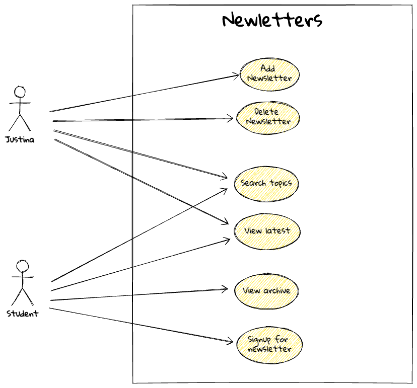

# Justinas nyhedsbrev - Fullstack

Nu skal vi i gang med at kode frontend og backend til Justinas nyhedsbrev. Vi skal bruge Javalin, Thymeleaf og en database.

## Plan

1. Først udarbejder vi et use-case diagram
2. Dernæst beskrives hver use-case som en user story
3. På baggrund af det laver vi en simpel domænemodel og på baggrund af den et ER-diagram (ERD) over databasen.
4. Så går vi i gang med at kode. Først oprettes et Java / Maven projekt i IntelliJ ([instruktioner](../../toolbox/javalin/setup.md)
5. Dernæst oprettes en database i Postgres og der lægges lidt fake data ind i tabellerne.
6. Når alt dette er på plads begynder vi at implementere de enkelte user stories en ad gangen.

Det bruger vi så resten af ugen på. Her er en cirka plan over hvad vi skal nå at gennemgå:

### Tirsdag

- [x] Use-case diagram
- [x] User stories
- [x] Domænemodel
- [x] ER-diagram
- [x] Projekt setup
- [x] Database setup
- [x] Indsæt fake data i databasen
- [x] Implementer den første user story

Der hører en del teknikker til at udvikle Javalin webapplikationer. Vi skal blandt andet gennem følgende:

- [x] Opsætning af Javalin projekt
- [x] Opsætning af Thymeleaf
- [x] Opsætning af Postgres database og ConnectionPool
- [x] Opsætning af datamappere
- [x] Opsætning af routes
- [ ] Opsætning af controllers
- [x] Opsætning af thymeleaf templates. Herunder layout, fragments, billeder, links, forms, knapper og diverse udtryk.
  - [x] Variable Expressions: `${}`
  - [x] Link (URL) Expressions: `@{}`
  - [ ] For-each loop: `th:each`
  - [x] Conditional statements: `th:if`, `th:unless`, `th:switch`, `th:case`
- [x] Behandling af http requests (GET, POST, PUT, DELETE)
- [x] Behandling af form data
- [ ] Brug af sessions

### Onsdag - codelab

I dag skal vi arbejde videre på nyhedsbrevsiden. Vi skal implementere de user stories vi har lavet. Vi tænker ikke så meget over
designet i dag. Det gemmer vi lidt. Vi vil gerne have noget funktionalitet op at køre.

Her er  vores use-case diagram:

For at kunne implementere disse use-cases skal vi have skaffet os adgang til en database.

Vi skal bruge en tabel til at gemme metainformation til nyhedsbrevene og en tabel til at gemme modtagere af nyhedsbrevene.
Vi skal vel også have en tabel til at gemme brugerne (Justina) + det løse. Lad os se på det sammen:

- [x] #### Opgave 1: Lav en domænemodel over de konceptuelle klasser og deres attributter

- [x] #### Opgave 2: Lav et ER-diagram over databasen

- [x] #### Opgave 3: Opret databasen i Postgres

Der er hjælp at hente her: [DB setup](../../toolbox/javalin/javalin_how_to.md#3-how-to-add-a-database)

- [x] #### Opgave 4: Indsæt fake data i tabellerne

Det gør det lettere at komme hurtigt i gang med at vise data i applikationen. Dvs, at man ikke behøver at oprette brugere, nyhedsbreve og modtagere manuelt, men blot hælder nogle rækker data ind i tabellerne.

- [x] #### Opgave 5: Implementer: Sign up for newsletter

Så er der vist rigeligt at tage fat på. Vi tager en ting ad gangen og hjælper hinanden.

### Torsdag

Vi begynder med at gøre status på hvor langt vi er nået og kører videre derfra.

- [ ] #### Opgave 6: Add newsletter (add metadata + upload PDF + thumbnail)

- [ ] #### Opgave 7: Implementer: View archived newsletters

### Fredag

- [ ] #### Opgave 8: Implementer: View latest newsletter

- [ ] #### Opgave 9: Implementer: Search functionality

- [ ] #### Opgave 10: Add styling

- [ ] #### Forbered præsentation af hvor langt du nået til mandag

## Indholdselementer (assets)

Her er nyhedsbrevene fra CPH Business. De er i PDF format og kan downloades:

1. [01 Sep Okt 2024](../../frontend/exercises/docs/01_Nyhedsbrev_SepOkt_2024.pdf)
2. [02 Okt Nov 2024](../../frontend/exercises/docs/02_Nyhedsbrev_OktNov_2024.pdf)
3. [03 Nov Dec 2024](../../frontend/exercises/docs/03_Nyhedsbrev_NovDec_2024.pdf)
4. [04 Dec Jan 2025](../../frontend/exercises/docs/04_Nyhedsbrev_DecJan_2025.pdf)
5. [05 Jan Feb 2025](../../frontend/exercises/docs/05_Nyhedsbrev_JanFeb_2025.pdf)
6. [06 Feb Mar 2025](../../frontend/exercises/docs/06_Nyhedsbrev_FebMar_2025.pdf)

Thumbnail filer:

1. [01 sep-okt](./images/thumbs/01_thumb-sep-okt-2024.png)
2. [02 okt-nov](./images/thumbs/02_thumb-okt-nov-2024.png)
3. [03 nov-dec](./images/thumbs/03_thumb-nov-dec-2024.png)
4. [04 dec-jan](./images/thumbs/04_thumb-dec-jan-2025.png)
5. [05 jan-feb](./images/thumbs/05_thumb-jan-feb-2025.png)
6. [06 feb-mar](./images/thumbs/06_thumb-feb-mar-2025.png)

## Logopakke og Designguide

- [Download logoer](https://www.cphbusiness.dk/kontakt/pressekontakt#-download-logo-item)
- [Design guide](../../frontend/exercises/docs/cphbusiness-designguide_final.pdf)

## Jonathans Figma mockup

- [Mockup - figma version](https://www.figma.com/proto/6E5WdfpD38vt9BpcILebE6/Newsletter_CPHBusiness?page-id=0%3A1&node-id=1-2&p=f&viewport=51%2C-451%2C0.95&t=vswb6lRQgjTvXCsd-1&scaling=min-zoom&content-scaling=fixed)
- [Mockup - PDF version](./docs/Newsletter_CPHBusiness.pdf)
