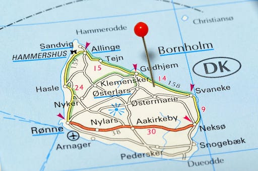

# CodeLab: Øvelse i UI design

## Carpool på Bornholm

### Brief

Vi er så heldige at Campus
Bornholm har valgt os til at
implementere et website, som
deres elever kan bruge til
samkørsel – til og fra Campus. Det er jeres opgave at lave en papir-prototype, en Figma prototype og en HTML / CSS prototype af forsiden.

### User stories

1. US-1: Som elev skal man kunne booke
en kørelejlighed fra Allinge,
Tejn, Gudhjem, Svanneke eller
Nexø til Rønne og evt. retur.

2. US-2: Som bilejer skal man kunne
oprette en kørelejlighed på en
given dato og klokkeslæt til/fra
de samme byer ovenfor.

### Jeres opgave

Gå sammen 2 og 2. Husk at [registrere jeres fremmøde på Moodle](https://cphbusiness.mrooms.net/mod/attendance/manage.php?id=770170)!

#### Intro - hvad er en papir-prototype?

1. Se et eksempel på en papir-prototype: [https://www.youtube.com/watch?v=2hkRfEpdcXw&t=1s](https://www.youtube.com/watch?v=2hkRfEpdcXw&t=1s)
2. Diskuter hvad der er godt og skidt ved en papir-prototype.

#### Del A: Lav en paper prototype af Carpool hjemmesiden

1. Brug papir, saks, tape, post-its og blyant / farver
2. Lav en papir-prototype af brugerdialogen. I må selv bestemme om det skal være en almindelig hjemmeside eller evt. en mobilvenlig udgave.
3. Tænk over "UX-love" i jeres design
4. Lad en test-bruger prøve jeres papir-prototype af – og "tænke højt" undervejs. Testbrugeren må ikke have været med til at lave papir-prototype’en, så lån en fra en anden gruppe. Optag testen på video - og upload til en YouTube kanal I ejer. Lav linket "Unlisted". Gem linket, så I kan aflevere det senere.

#### Del B: Lav en Figma prototype af Carpool hjemmesiden

1. Opret i projekt i Figma og del det med din makker
2. Brug Figma til at lave en prototype af brugerdialogen med de samme elementer som i paper prototypen - inkl. de rettelser I har lavet efter testen.
3. Vælg "Share Prototype" og kopier linket til jeres prototype. Det skal afleveres senere.

#### Del C: Lav en HTML / CSS prototype af Carpool forsiden

1. Lav en enkelt HTML / CSS udgave af en af jeres Figma frames. Det kunne fx være forsiden. Keep it simple. I skal bare kunne vise siden i en lokal browser.
2. Upload jeres HTML / CSS til et GitHub repo

#### Del D: Aflevering

Aflever links til jeres papir-prototype, Figma prototype og GitHub repo på Moodle. Begge team-medlemmer skal aflevere. Her er [afleveringssiden](https://cphbusiness.mrooms.net/mod/assign/view.php?id=781053).

