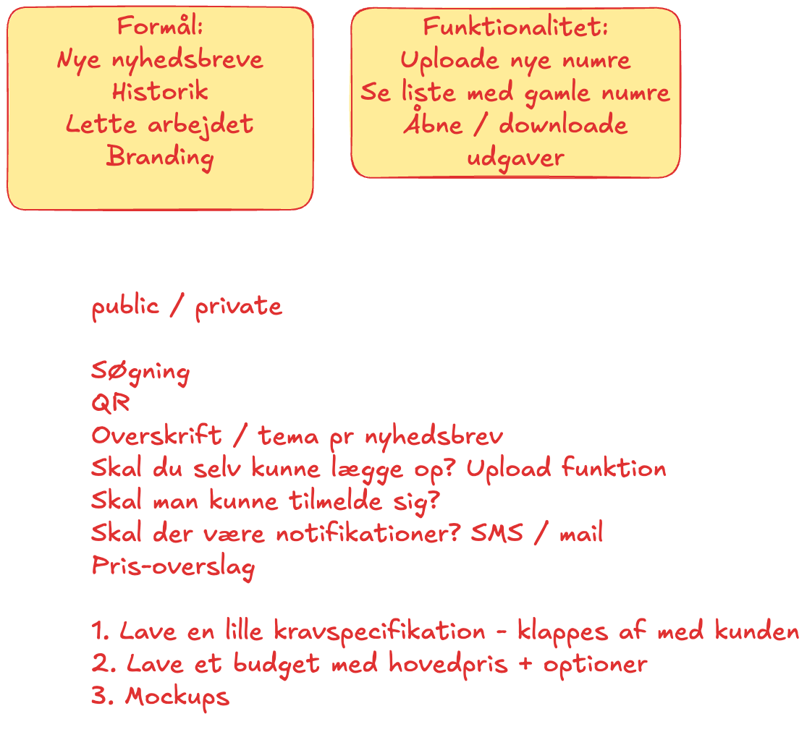

# Justinas nyhedsbreve

## Opgaven

Ud fra det "kundemøde" vi havde med Justina i tirsdags, skal I nu lave en mockup af en hjemmesideløsning.

1. Lav en mockup i Figma, der viser hvordan løsningen kunne se ud.
2. Lave en HTML / CSS prototype af løsningen. I behøver ikke at kode det hele. Men se hvor langt I kan komme. Prøv også at lave det reponsivt.
3. Skriv de valg ned I foretager undervejs og indsæt dem i en README.md fil i jeres projekt.
4. Gør klar til at lave en lille demo på mandag. Vi vil gerne se jeres Figma mockup,  jeres HTML / CSS prototype og høre om jeres valg undervejs.

## Ikke funktionelle krav

1. Designet skal være enkelt og overskueligt
2. Designet skal være responsivt
3. Designet skal (nogenlunde) være i overensstemmelse med CPH Business' designguide
4. I skal ikke bekymre jer om at lave det funktionelt. Det er fint at lave en statisk side.
5. Noter jeres valg undervejs i en **README.md** fil. F.eks. hvis dele af siden ikke kan nøjes med at være statisk. Det kunne en søgefunktion, login, upload etc.

## Indholdselementer (assets)

Her er nyhedsbrevene fra CPH Business. De er i PDF format og kan downloades:

1. [01 Sep Okt 2024](./docs/01_Nyhedsbrev_SepOkt_2024.pdf)
2. [02 Okt Nov 2024](./docs/02_Nyhedsbrev_OktNov_2024.pdf)
3. [03 Nov Dec 2024](./docs/03_Nyhedsbrev_NovDec_2024.pdf)
4. [04 Dec Jan 2025](./docs/04_Nyhedsbrev_DecJan_2025.pdf)
5. [05 Jan Feb 2025](./docs/05_Nyhedsbrev_JanFeb_2025.pdf)
6. [06 Feb Mar 2025](./docs/06_Nyhedsbrev_FebMar_2025.pdf)

## Logopakke og Designguide

- [Download logoer](https://www.cphbusiness.dk/kontakt/pressekontakt#-download-logo-item)
- [Design guide](./docs/cphbusiness-designguide_final.pdf)

## Noter fra mødet med Justina

{: width="50%" .mt-4}
