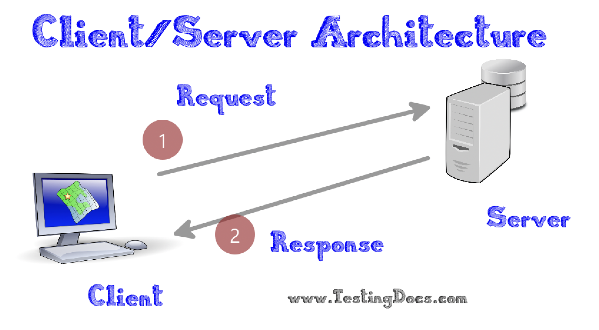
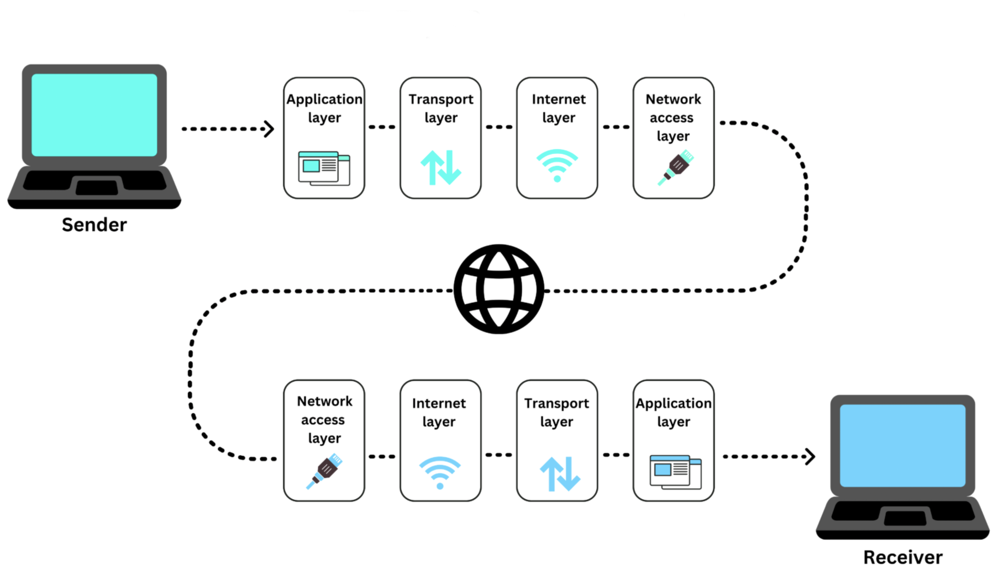

# Network Exercises Part 1: Network, Sockets, and TCP/IP

[Back to Overview](README.md)

## Task 1: What is a socket in Java?

1.1 Define what a socket is in Java.

1.2 Which protocol is used for communication through a ServerSocket?

1.3 What is UDP, and what is it commonly used for? If we want to use UDP, how do we do that in Java?

1.4 If you were to create a chat server, which protocol would you use—and why?

## Task 2: Client/Server Principle

These two figures both show a client/server scenario.

2.1 What is the primary difference between them?

2.2 Which of the two figures below do you think best describes a web server, and which one an online game server? And why? Imagine that both figures illustrate a single request from a client.

### Case 1

### Case 2

## Task 3: Network Traffic (Layering)

How should this model be understood? Try to explain the model assuming an HTTP request is being sent. This model is often called "The Internet Protocol Suite" or the "TCP/IP Model."

## Task 4: IP Addresses, DNS, and Ports

4.1 Find your laptop's internal IP address, i.e., the IP number you have on our LAN. How do you do this? It depends on whether you have Windows, macOS, or Linux.

4.2 What is your external IP number, i.e., the IP you have from the internet? Hint: use, for example, [https://www.myip.com/](https://www.myip.com/).

4.3 Why is there a difference between the two IP numbers?

4.4 Find the IP number of Cphbusiness' web server: [https://www.cphbusiness.dk/](https://www.cphbusiness.dk/).

4.5 What is the IP number of your DNS server—and what is DNS again?

4.6 Which port does HTTP normally run on?

4.7 Which port does HTTPS run on?

4.8 What is the difference between HTTP and HTTPS?

## Task 5: Coding Exercise - NetworkDemos - Clone Repository

5.1 Navigate to a folder where you want to place this week's demo code.

5.2 Clone our exercise repository [networkdemo](https://github.com/jonbertelsen/networkdemo/).

5.3 Open the project in IntelliJ and buckle up.

5.4 Skim through the README file to get an overview.

5.5 Run all unit tests at once.

## Task 6: Run Demo 01: SimpleClient and SimpleServer

6.1 Expand the package named `demo01_singlerequest` and open the two classes.

6.2 First, run the `main` method in `SimpleServer`.

6.3 Then, run the `main` method in `SimpleClient`.

6.4 What happens?

6.5 Review the code and try to understand what is happening. Can you describe it in your own words? Refer to the README.md file for inspiration if needed.

6.6 Try running demo 01 through its corresponding unit test as well.

## Task 7: Extend Demo 01

7.1 Modify `SimpleServer` so that it sends the current date and time back to the client.

7.2 Bonus exercise: Check the time of day, and send a small message indicating whether it is morning, afternoon, evening, or night. For example: "Hello - good morning, the time is now 09:45, and today's date is 2024-02-06."

## Task 8: Run Demo 02: EchoClient and EchoServer

8.1 Expand the package named `demo02_multiplerequests` and open the two classes.

8.2 First, run the `main` method in `EchoServer`.

8.3 Then, run the `main` method in `EchoClient`.

8.4 What happens?

8.5 Review the code and try to understand what is happening. Can you describe it in your own words? Refer to the README.md file for inspiration if needed.

## Task 9: Extend Demo 02

9.1 Extend `EchoClient` so you can input messages from the keyboard, which are sent to the server every time you press **Enter**. Use a `Scanner` object, which you are familiar with from the first semester. This way, we can send as many messages as we want.

9.2 Bonus: Extend `EchoServer` so it adds some quotes to your text. Use, for example, `Random` to vary the quotes a bit.

## Task 10: Communicate Across Machines

10.1 Work in pairs. Person A finds their local IP number and shares it with Person B.

10.2 Person A starts `EchoServer` on their machine.

10.3 Person B enters Person A's IP number in their `EchoClient` and starts it. Now B should be able to send messages to A.

10.4 Try switching roles.

10.5 Bonus exercise: Also add a `Scanner` on `EchoServer`, so the server can send messages back to the client. This is probably the most primitive chat scenario imaginable, but still, it's a good start.

[Back to Overview](README.md)
