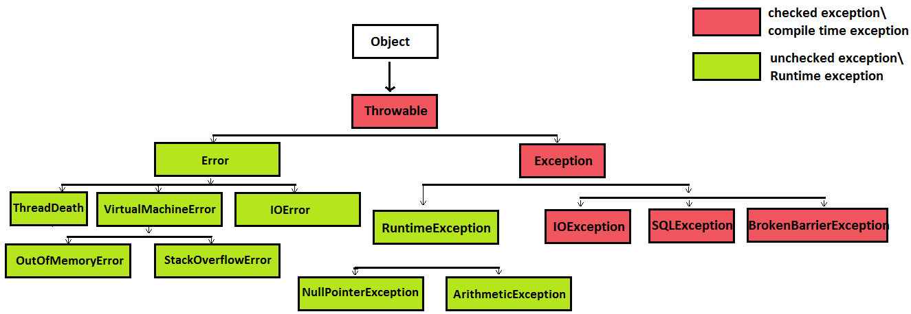

# Fejlfinding og debugging i IntelliJ

# Exceptions in Java

Lidt teori og eksempler på brug af exceptions i Java:

* [Video om checked- og unchecked exceptions og custom exceptions](https://cphbusiness.cloud.panopto.eu/Panopto/Pages/Viewer.aspx?id=acb43f3a-51e0-425f-a453-adfd0145ee25)
* [Gist](https://gist.github.com/jonbertelsen/f1257ee0ccc17508047e49990945d35a) med eksempelkoden fra videoen
* [Kapitel om exceptions fra DocJava-bogen](http://www.docjava.dk/java_specielt/exceptionhandling/exceptionhandling.htm)
* [God artikel](https://howtodoinjava.com/java/exception-handling/checked-vs-unchecked-exceptions-in-java/) på engelsk hvis du gerne vil læse om det i stedet
* [Tutorials point on java exceptions](https://www.tutorialspoint.com/java/java_exceptions.htm)
* [Jenkov tutorial on logging](http://tutorials.jenkov.com/java-logging/handlers.html)

## Subjects

* What are errors?
* Why do errors happen?
* Types of errors
* What to do about errors?
* Exceptions
  * Unchecked / Checked
  * Throws / TryCatchFinally
  * Throw
  * Custom / Extends / Methods

## WHAT ARE ERRORS ?

When the code produces erroneous results

* 2 + 2 = 5
* 404 not found

## WHY DO ERRORS HAPPEN?

When the code generate errors it can happen for 3 reasons

1. The programmer made a mistake
2. The environment changed unexpectedly
3. The program user has made a mistake

BAD CODING In the first case the programmer has made a mistake:

* divide by zero
* index out of bound etc.

ENVIRONMENT PROBLEMS In the second case some physical resource has failed in some way.

* internet connection was lost
* disk error etc.

USER INITIATED ERRORS In the third case the user has made an error  
E.g.

* 403 forbidden when trying to access a protected resource
* Not a number when putting letters in a number field in a form

### TYPES OF ERRORS

* Syntax errors: Language syntax is not respected
* Semantic errors: Improper use of program statements
* Logical errors: Undesired behavior
* Compile time errors: Syntax errors and static semantic errors indicated by the compiler
* Runtime errors: Dynamic semantic errors and logical errors, that cannot be detected by the compiler

WHAT TO DO ABOUT ERRORS?

Errors should be handled  
User should be notified  
Log files should be updated  
Program should continue

In Java there are exceptions

When an exception occur the normal flow of the program is disrupted and the program/application terminates abnormally, which is not recommended, therefore, exceptions should be handled.

UNCHECKED EXCEPTIONS

* Unchecked exceptions occur at run time
* The code will compile even though code throws an exception
* These exceptions mostly comes from bad data from the user
* These exceptions are direct sub classes of RuntimeException class `int result = 2/0;` This will throw an arithmeticException, but it will compile

CHECKED EXCEPTIONS

* Checked exceptions occur at compile time
* These are also called ‘compile time exceptions’.
* These exceptions cannot be ignored at the time of compilation
* The programmer should take care of these exceptions

IntelliJ message: “Exception must be caught or declared to be thrown”:

* FileNotFoundException
* IOException
* SQLException

## Handle Exceptions

THROWS  

If a method does not handle a checked exception, the method must declare it using the throws keyword. The throws keyword appears at the end of a method’s signature.

`public Person getPersons() throws ArithmeticException {....}`

`public Person getPersons() throws MyException {....}`

THROW

You can throw an exception, either a newly instantiated one or an exception that you just caught, by using the throw keyword.

`throw new ArithmeticException();`

`throw new MyException();`

TRY-CATCH-FINALLY

* Try something that might throw an exception
* Catch the exception if it occurs
* Finally do something in any case

Catch subclass or superclass  
Catch subclass exception  
catch (ArithmeticException Excep)  
Catch superclass exception  
catch (Exception Excep)

Multiple catch types  
Different exceptions can be caught in a single catch

`catch (NumberFormatException | ArithmeticException Excep){}`

Use the different exception methods

* e.printStackTrace()
* e.getMessage()
* e.getStackTrace()\[\]

    ex.printStackTrace();  
    System.out.println(Excep.getMessage());  
    System.out.println("printStackTrace: " + ex.getStackTrace()[0].toString());
    System.out.println("printStackTraceArrays" + Arrays.toString(ex.getStackTrace()));  

### DON´T

* **Catch an exception and do _nothing_**
* Catch an exception and do `Logger.getLogger(A.class.getName()).log(Level.SEVERE, null, ex);` if Logger is not configured
* Throw architectural layer specific exceptions into layers where they do not belong
  * For instance SQL exceptions up through the layers to a Servlet (presentation layer)
* Instead wrap and modify the exception as a domain layer specific exception -> and push to The user or to A log file

### CUSTOM EXCEPTIONS  

You can create your own exceptions in Java.

* If you want to write a checked exception, you need to extend the Exception class.(**common way**)
* If you want to write a runtime exception, you need to extend the RuntimeException class.

All exceptions must be a child of Throwable.

`class MyException extends Exception {}`

An exception class is like any other class and useful fields and methods can be added if needed.
